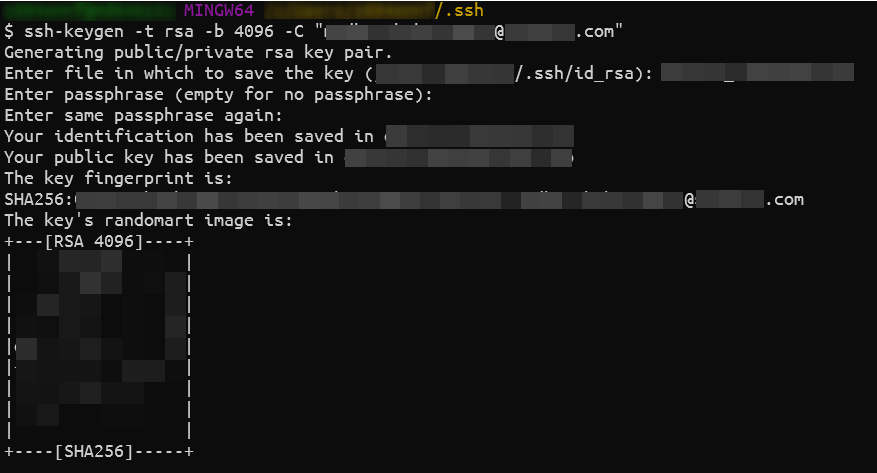
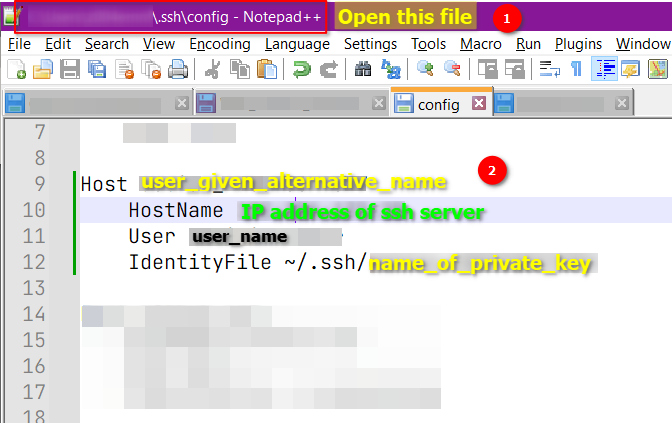
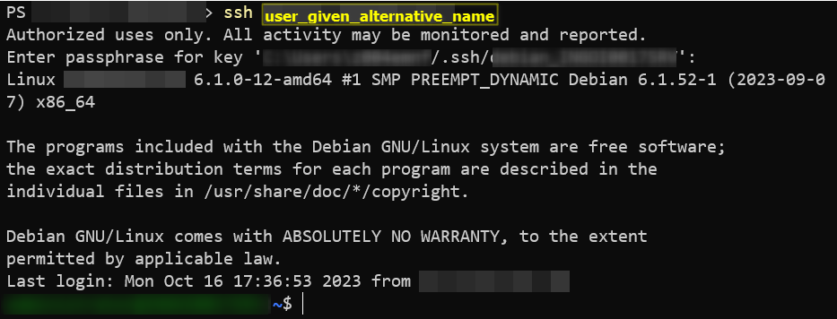

# SSH into SSH server with Public Private Key pair
- Go to `~/.ssh`
  ```
  cd ~/.ssh
  ```

- Create public-private key pair
  ```
  ssh-keygen -t rsa -b 4096 -C "your.mail@id.com"
  ```
  - Give a name to your key pair files or keep it default
  - give a passphrase for your private key or keep it empty
  

- Copy the public key to server
  ```
  ssh-copy-id -i public_key.pub user_name@ip_address
  ``` 
  - `-i` is the identity file aka the public key
  

- Login to ssh server and go to `~/.ssh` folder
  - Your public key will be added to `authorized_key` file
  


- On the ssh client open the `~/.ssh/config` file and add this
  

- Close all the logins to the ssh server
  - open powershell and login using the `user_given_alternative_name`
  