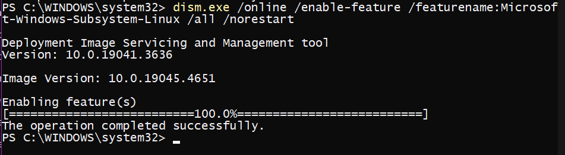
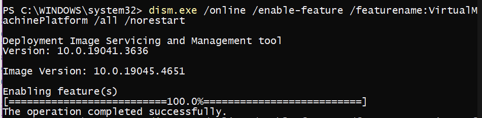
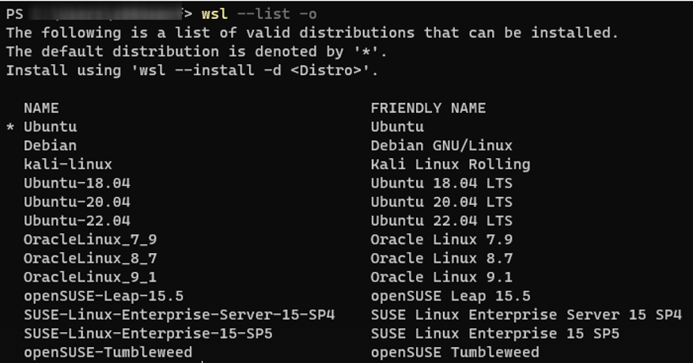
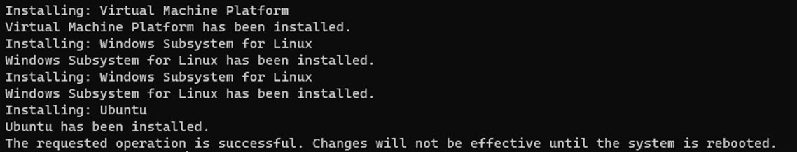
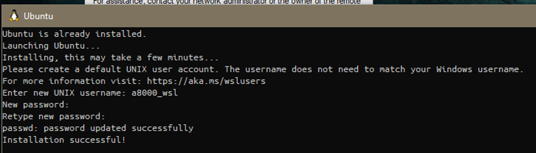
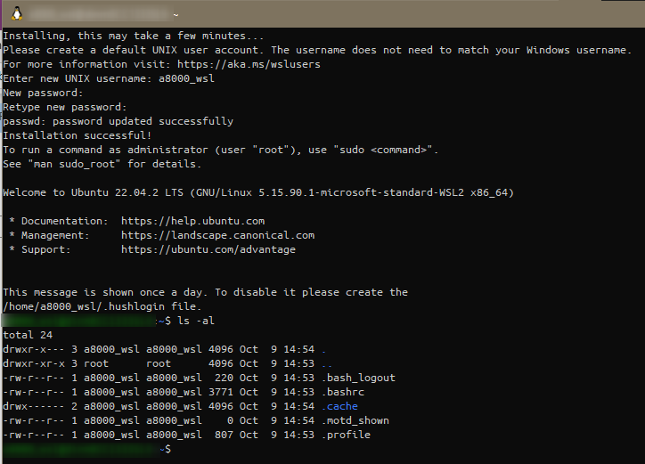
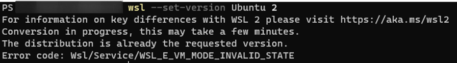
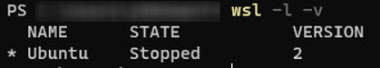
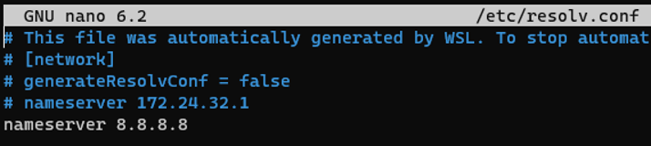
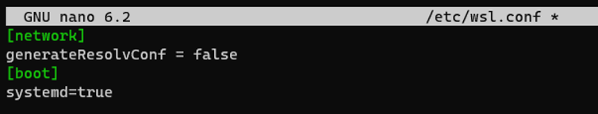

# Setup Windows Subsystem for Linux (WSL)
> **NOTE**:
> 1. Following commands must be executed in ***admin mode power shell***
> 2. For more info on [WSL](https://docs.microsoft.com/en-us/windows/wsl/install-win10)
> 
## Setting up WSL in power shell
- Run powershell in admin mode
- enable the "Windows Subsystem for Linux" optional feature ([source](https://learn.microsoft.com/en-us/windows/wsl/install-manual))
  ```
  dism.exe /online /enable-feature /featurename:Microsoft-Windows-Subsystem-Linux /all /norestart
  ```
  

- enable the Virtual Machine Platform optional feature
  ```
  dism.exe /online /enable-feature /featurename:VirtualMachinePlatform /all /norestart
  ```
  
- Download and install the Linux kernel update package from [here](https://learn.microsoft.com/en-us/windows/wsl/install-manual#step-4---download-the-linux-kernel-update-package)

- To see a list of the Linux distributions 
  ```
  wsl --list -o
  ```
  
  
- Install latest Ubuntu in wsl 
  ```
  wsl --install -d Ubuntu
  ```
  
  
  

- Set WSL version to 2 
  ```
  wsl --set-version Ubuntu 2
  ```
  
- To check the WSL mode 
  ```
  wsl -l -v
  ```
  
- To update the WSL kernel 
  ```
  wsl --update
  ```

## On Windows
- Accessing wsl files in Windows Explorer. Type the following after starting wsl in File Explorer Address bar
  ```
  \\wsl$
  ```

## On WSL
Command                                     | Description
---                                         | ---
`sudo apt-get update && sudo apt-get upgrade` | Update and upgrade in one command
`sudo -i` 		                                | To become root
`uname -a`		                                | Entire name of system
`cd /mnt/c` 		                              | C drive
`cd /mnt/d` 		                              | D drive


## Unable to access internet through WSL
- If ping google.com doesn't work try following. Getting `sudo apt update && apt upgrade` working.
```
sudo nano /etc/resolv.conf
```
- Change nameserver to following line
```
nameserver 8.8.8.8
```

- To make this change permanent create file _**/etc/wsl.conf**_
```
sudo nano /etc/wsl.conf
```
- Add following to the file
```
[network]
generateResolvConf = false
```


## Manual way of installing WSL
[Reference](https://learn.microsoft.com/en-us/windows/wsl/install-on-server)

Run the following cmds in **admin mode powershell**.

- Enable the "Windows Subsystem for Linux"
  ```
  dism.exe /online /enable-feature /featurename:Microsoft-Windows-Subsystem-Linux /all /norestart
  ```

- Enable the Virtual Machine Platform
  ```
  dism.exe /online /enable-feature /featurename:VirtualMachinePlatform /all /norestart
  ```

- Download and install the Linux kernel update package from [here](https://learn.microsoft.com/en-us/windows/wsl/install-manual#step-4---download-the-linux-kernel-update-package)

- Set WSL 2 as your default version
  ```
  wsl --set-default-version 2
  ```

- You can download your preferred distribution(s) via the powershell
[List of Distributions](https://learn.microsoft.com/en-us/windows/wsl/install-manual#downloading-distributions)
  ```
  Invoke-WebRequest -Uri https://aka.ms/wslubuntu -OutFile Ubuntu.appx -UseBasicParsing
  ```

- Navigate to the folder containing the download and run the following command in that directory
  ```
  Add-AppxPackage .\Ubuntu.appx
  ```